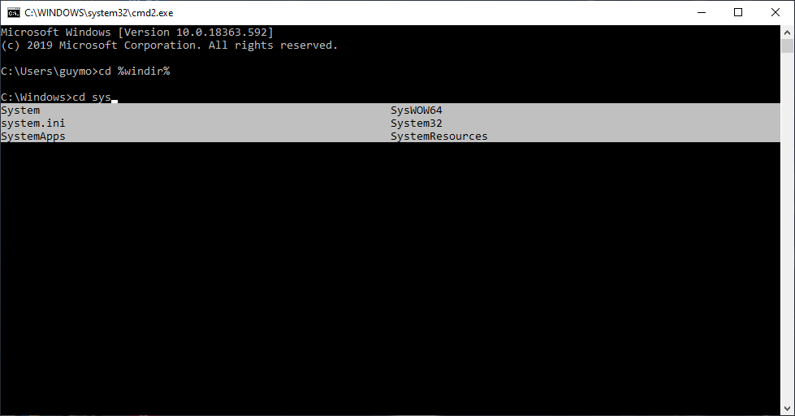

# ICmd
A small lightweight dll which **extends cmd.exe auto-complete capabilities (ipython like):**

This program's output is a dll.
It requires (for now) external loading of the dll into cmd.exe.
(Simplest way - import edit cmd.exe to import ICmd.dll)

**It's not very user-friendly, and not "production ready".**
