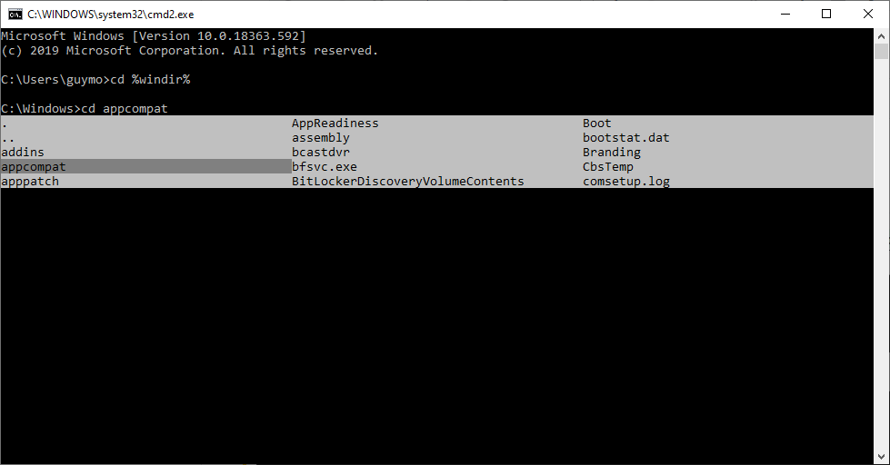

# ICmd
A small lightweight dll which **extends cmd.exe auto-complete capabilities (ipython like).**

## Tech Info
This program's output is a dll.
It requires (for now) external loading of the dll into cmd.exe.
(Simplest way - import edit cmd.exe to import ICmd.dll)
The current standard is to run cmd.exe through a bat-script (`start_cmd_with_icmd64.bat`) which will run cmd.exe with withdll.exe.
**It's not very user-friendly, and not "production ready".**

## "Installation"
1. Clone this project
2. Build (you may need to clear the build-event scripts)
3. Run `start_cmd_with_icmd64.bat`
